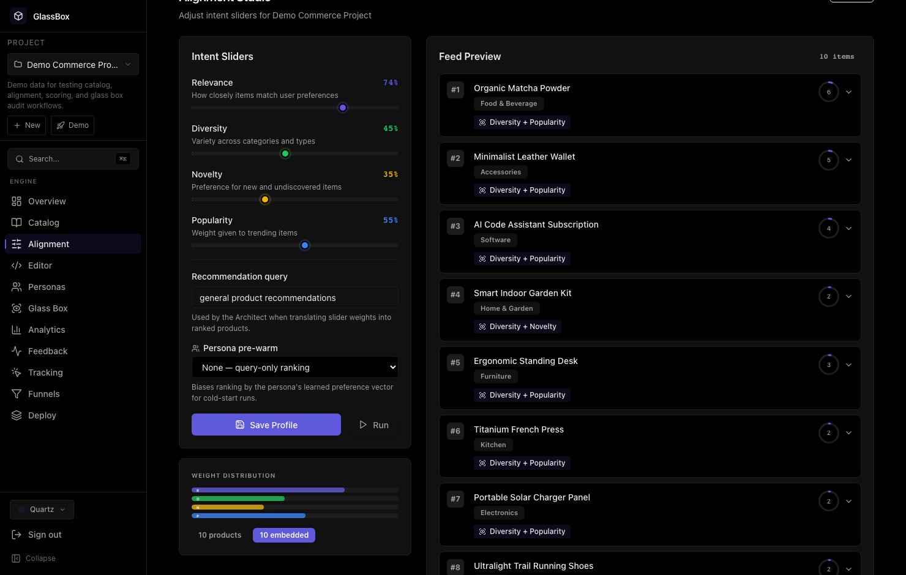
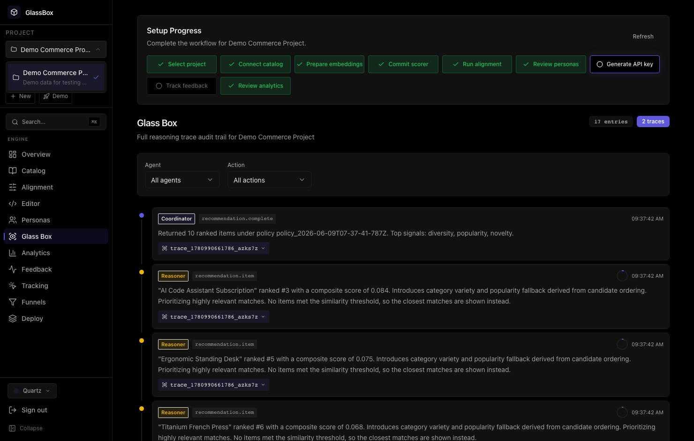
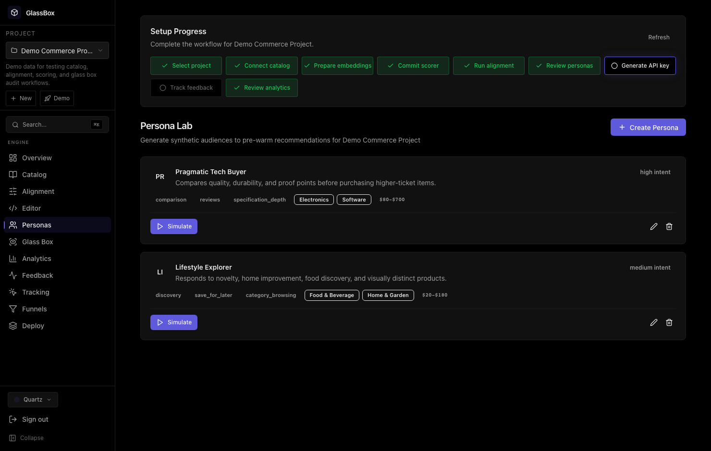
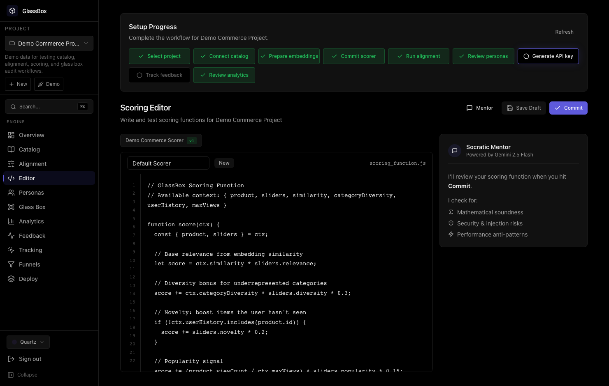
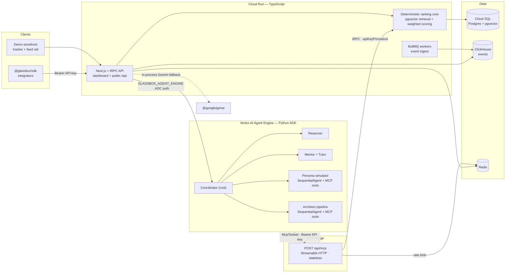

# GlassBox Engine

An AI-powered recommendation engine with explainable AI. GlassBox provides personalized product feeds while maintaining full transparency about how recommendations are ranked through reasoning chains, confidence scores, and audit trails.

> **Live:** [glassboxengine.dev](https://glassboxengine.dev) · **Demo store:** [demo.glassboxengine.dev](https://demo.glassboxengine.dev) · **API reference:** [glassboxengine.dev/docs](https://glassboxengine.dev/docs)

Built with **Google's Agent Development Kit (ADK)** and **Gemini**, GlassBox makes
personalization transparent, testable, and aligned with business goals across four
value pillars:

| Pillar | Feature | What it does |
|---|---|---|
| 🟦 **Explainability** | Glass Box reasoning traces | Every recommendation ships a faithful decision trace — only what the ranking math actually did, never a prompt-spun story. |
| 🟩 **Logic Drift** | Intent Sliders + Architect Agent | Describe a business goal in plain language; the **ADK Architect agent** proposes a transparent reward-function config. Pin a feed, drag sliders, and see exactly what moved. |
| 🟪 **Cold Start** | Persona Lab | Generate synthetic personas, simulate their behaviour, and A/B two strategies across every segment before shipping. |
| 🟨 **Education** | Socratic Mentor | Commit a scoring function and an **ADK Mentor agent** reviews it like a senior engineer — a multi-turn Socratic dialogue, never the fixed code. |

### The four pillars, live in production

| Logic Drift — Intent Sliders | Explainability — Glass Box traces |
|---|---|
|  |  |
| **Cold Start — Persona Lab** | **Education — Socratic Mentor** |
|  |  |

## Architecture

GlassBox uses a **hybrid** runtime: the deterministic ranking core and all app services
are TypeScript on **Cloud Run**, while the LLM-reasoning agents run as a **Python ADK**
service on **Vertex AI Agent Engine**. In production the TS side calls the deployed
reasoning engine directly (`GLASSBOX_AGENT_ENGINE`, authenticated via the Cloud Run
runtime SA); for local dev it can target an `adk api_server`
(`GLASSBOX_AGENT_SERVICE_URL`). Both paths keep an in-process `@google/genai` fallback
so the product never dead-ends if the agent service is unavailable.



The LLM agents **reason about** the recommendation; the deterministic core **decides**
it — so every score stays reproducible and auditable.

```
apps/web                 Next.js 16 frontend + tRPC API handler
packages/api             tRPC routers (business logic)
packages/agents          TS agents: deterministic ranking core + the Architect advisor,
                         Reasoner/Mentor/Persona, and the Agent Engine client
packages/database        PostgreSQL schema (Drizzle ORM + pgvector)
packages/event-pipeline  BullMQ job queue + ClickHouse event store
packages/telemetry       OpenTelemetry instrumentation (traces, metrics, logging)
packages/sdk             Client SDK for consuming applications
packages/config          Shared TypeScript and ESLint configs
apps/demo-store          Storefront that emits events and renders the engine's feed rail
services/glassbox-agents Python ADK agents (Coordinator → Reasoner/Mentor/Mentor-chat/
                         Persona/Architect) → deploys to Vertex AI Agent Engine
infra/terraform          GCP IaC: Cloud Run, Cloud SQL (pgvector), Memorystore, Secret Manager
```

The four value pillars and their verified screenshots are documented in
[docs/feature-status.md](docs/feature-status.md). Deployment is covered in
[docs/deployment-runbook.md](docs/deployment-runbook.md). A sub-3-minute walkthrough
script for the demo video is in [docs/demo-script.md](docs/demo-script.md).

## MCP (Model Context Protocol) integration

The Python ADK agents on Vertex AI Agent Engine connect back to the TypeScript platform via a **Streamable HTTP MCP server** at `POST /api/mcp`. The same project API key (`gb_live_...`) that authenticates the public SDK endpoints authenticates every MCP call; all data is scoped to the resolved project.

**Five tools are exposed:**

| Tool | What it does |
|---|---|
| `get_feed` | Ranked recommendations (wraps `glassBox.recommend`) |
| `get_catalog` | Project product catalog |
| `get_scoring_config` | Active scoring function + slider defaults |
| `track_events` | Write interaction events to the feedback pipeline |
| `translate_sliders` | Pure deterministic math: slider values → retrieval parameters |

The **Persona Simulator** agent uses `get_catalog`, `get_feed`, and `track_events` to ground cold-start simulations in live data. The **Architect** agent uses `get_scoring_config` and `get_feed` alongside the local `translate_slider_config` tool to anchor slider proposals in real platform state.

Any third-party MCP client (Claude Desktop, MCP Inspector, custom agent) can also connect by pointing at `https://glassboxengine.dev/api/mcp` with a project API key.

Full details — architecture diagram, per-tool input/output reference, auth model, env vars, connection snippets, and the `output_schema`/tools split design note — are in **[docs/mcp-integration.md](docs/mcp-integration.md)**.

## Prerequisites

- Node.js >= 22
- pnpm 10.8.1
- Docker (for local infrastructure)

## Quick Start

```bash
# Start infrastructure (Postgres+pgvector, Redis, ClickHouse)
docker-compose up -d

# Install dependencies
pnpm install

# Copy environment variables
cp .env.example .env.local

# Push database schema
pnpm db:push

# Start development server
pnpm dev

# In a separate terminal, start event pipeline workers
pnpm -F @glassbox/event-pipeline workers
```

The app will be available at http://localhost:3000.

For the first production-like run, open `Catalog Studio` after sign-in and either upload a CSV/JSON catalog or connect a hosted feed URL. GlassBox now persists import connections separately from project metadata so operators can inspect source history and re-run ingestion safely.

## Environment Variables

| Variable | Description | Required |
|---|---|---|
| `DATABASE_URL` | PostgreSQL connection string | Yes |
| `BETTER_AUTH_SECRET` | Auth secret (min 32 chars) | Yes |
| `BETTER_AUTH_URL` | Auth service URL | Yes |
| `GOOGLE_API_KEY` | Gemini API key for agents | Yes |
| `GLASSBOX_AGENT_ENGINE` | Vertex AI Agent Engine resource name (`projects/<p>/locations/<l>/reasoningEngines/<id>`); routes agent calls to the Python ADK agents via ADC (prod path) | No (in-process fallback) |
| `GLASSBOX_AGENT_SERVICE_URL` | Local `adk api_server` URL for the Python agents (dev alternative) | No |
| `GLASSBOX_MCP_URL` | MCP server URL exposed to the Python ADK agents, e.g. `https://glassboxengine.dev/api/mcp` (agent side) | No (MCP disabled when unset) |
| `GLASSBOX_MCP_API_KEY` | Project API key sent as `Bearer` token by ADK agents to the MCP server (agent side) | No (MCP disabled when unset) |
| `NEXT_PUBLIC_APP_URL` | Frontend URL | Yes |
| `REDIS_URL` | Redis URL for BullMQ | Yes |
| `CLICKHOUSE_URL` | ClickHouse HTTP URL | Yes |
| `CLICKHOUSE_DATABASE` | ClickHouse database name | No (default: glassbox) |
| `OTEL_SERVICE_NAME` | OpenTelemetry service name | No |
| `OTEL_EXPORTER_OTLP_ENDPOINT` | OTLP collector endpoint | No |
| `LOG_LEVEL` | Log level (debug, info, warn, error) | No (default: info) |

## Scripts

```bash
pnpm dev              # Start all services in dev mode
pnpm build            # Build all packages
pnpm lint             # Lint all packages
pnpm typecheck        # Type-check all packages
pnpm test             # Run unit tests
pnpm test:coverage    # Run tests with coverage
pnpm format           # Format code with Prettier
pnpm format:check     # Check formatting

pnpm db:generate      # Generate Drizzle migrations
pnpm db:push          # Push schema to database
pnpm db:migrate       # Run migrations
pnpm db:studio        # Open Drizzle Studio
```

## Testing

```bash
# Run all tests
pnpm test

# Run tests in watch mode
pnpm test:watch

# Run with coverage
pnpm test:coverage

# Run recommendation quality fixtures
pnpm -F @glassbox/agents test:eval

# Print a recommendation quality report
pnpm -F @glassbox/agents eval:report

# Score a file-based evaluation dataset and emit a CI-friendly JSON artifact
pnpm -F @glassbox/agents eval:report --dataset evals/sample-recommendation-eval.json --json-out ../../artifacts/recommendation-eval.json

# Generate a dataset from real feedback history, then score it
DATABASE_URL=postgresql://... pnpm -F @glassbox/agents eval:generate --project-id <project-uuid> --days 90 --out ../../artifacts/recommendation-eval-real.json
pnpm -F @glassbox/agents eval:report --dataset artifacts/recommendation-eval-real.json --json-out ../../artifacts/recommendation-eval-real-report.json

# Export the same real feedback history into the portable JSON format
DATABASE_URL=postgresql://... pnpm -F @glassbox/agents eval:export-feedback --project-id <project-uuid> --days 90 --out ../../artifacts/recommendation-feedback-export.json

# Or convert a support/export JSON without live DB access
pnpm -F @glassbox/agents eval:convert-feedback-export --input evals/sample-feedback-export.json --out ../../artifacts/recommendation-eval-from-export.json
pnpm -F @glassbox/agents eval:report --dataset artifacts/recommendation-eval-from-export.json --json-out ../../artifacts/recommendation-eval-from-export-report.json

# One-step export evaluation pipeline with dataset, JSON report, text report, and summary artifact
pnpm -F @glassbox/agents eval:run-feedback-export --input evals/sample-feedback-export.json --out-dir ../../artifacts/recommendation-eval-from-export
```

## Recommendation Quality

GlassBox now includes an offline recommendation-quality harness that exercises the same slider weighting and score math used by the ranking pipeline.

It currently checks:

- `precision@3`
- `precision@5`
- `ndcg@5`
- category coverage at `k=5`
- average confidence of the top 5 results

The baseline scenarios live in [packages/agents/src/evaluation-fixtures.ts](/Users/lahiruramesh/sylonik/glassbox-engine/packages/agents/src/evaluation-fixtures.ts:1) and cover:

- high-intent focused search
- exploratory lifestyle browsing
- novelty-seeking fashion discovery

Use this before releases to catch quality regressions in recommendation ordering even when UI and API tests are still green.

For the full repo-side launch checklist, see [docs/production-readiness.md](/Users/lahiruramesh/sylonik/glassbox-engine/docs/production-readiness.md:1).

## Docker

```bash
# Build the production image
docker build -t glassbox-engine .

# Run with docker-compose (includes infrastructure)
docker-compose -f docker-compose.yml -f docker-compose.production.yml up
```

## Production Notes

```bash
# Re-apply schema updates after pulling new code
pnpm db:push

# Build and verify the critical packages
pnpm -F @glassbox/api test
pnpm -F @glassbox/api typecheck
pnpm -F web typecheck
```

- `Catalog Studio` is the recommended ingestion entrypoint for production onboarding.
- Source connections are stored in `catalog_sources`, while product rows remain in `products`.
- ClickHouse and BullMQ stay focused on event ingestion and analytics, not catalog truth.

## SDK Usage

```typescript
import { GlassBox } from "@glassbox/sdk";

const client = new GlassBox({
  endpoint: "https://your-api.example.com/api",
  apiKey: "gb_live_...",
});

// Get personalized feed
const recommendation = await client.getPersonalizedFeed("user-123", {
  limit: 10,
  sliders: { relevance: 0.8, diversity: 0.6 },
});

// Get reasoning chain for a recommendation
const reasoning = await client.getReasoningChain(
  "user-123",
  recommendation.items[0].itemId
);

// Track user interaction
await client.trackEvent({
  endUserId: "user-123",
  productId: recommendation.items[0].itemId,
  eventType: "click",
});
```

## Database Backups

```bash
# Backup PostgreSQL
DATABASE_URL="..." ./scripts/backup-postgres.sh

# Restore PostgreSQL
DATABASE_URL="..." ./scripts/restore-postgres.sh ./backups/glassbox_20260505_120000.dump

# Backup ClickHouse
CLICKHOUSE_URL="http://localhost:8123" ./scripts/backup-clickhouse.sh
```
