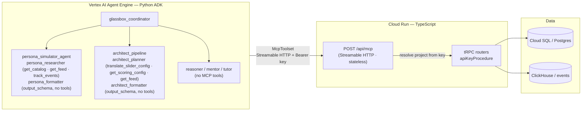

# GlassBox MCP Integration

## What is MCP?

The [Model Context Protocol (MCP)](https://modelcontextprotocol.io) is an open standard that lets AI clients — agents, LLM runtimes, IDE tools — call external capabilities through a uniform JSON-RPC interface. MCP servers expose typed tools (functions with input/output schemas) over a transport; clients discover and invoke them at runtime. GlassBox implements a **Streamable HTTP MCP server** so any MCP-capable client can read recommendations, inspect the catalog, track events, and probe scoring config using the same API key it already has for the public SDK endpoints.

---

## Architecture



The ADK agents connect via `google.adk.tools.mcp_tool.McpToolset` with `StreamableHTTPConnectionParams`, passing the project API key as `Authorization: Bearer <key>`. The MCP server is **stateless** — each JSON-RPC request creates a fresh server instance, resolves the project from the key, and closes. No session state is maintained between calls.

---

## The five tools

| Tool | Wraps | Input | Output |
|---|---|---|---|
| `get_feed` | `glassBox.recommend` | `userId?` (defaults `"mcp-agent"`), `queryText?`, `limit?` (1-100), `category?`, `sliders?` (`relevance/diversity/novelty/popularity` 0-1 each) | Ranked items with score breakdowns, reasoning labels, `traceId` |
| `get_catalog` | `catalog.sdkList` | `limit?` (default 50, max 100), `category?` | Array of catalog products: `id`, `externalId`, `title`, `category`, `metadata` |
| `get_scoring_config` | `scoring.sdkGetConfig` | _(none)_ | Committed scoring function (if any) + active intent-profile slider defaults |
| `track_events` | `feedback.sdkTrackBatch` | `events[]` — each with `userId`, `type` (`view`/`click`/`cart_add`/`purchase`), `itemId` (**must be the catalog UUID**), `metadata?`; batch 1-100 | Batch acknowledgement |
| `translate_sliders` | pure deterministic math | `relevance`, `diversity`, `novelty`, `popularity` (all 0-1) | `{ sliders, similarityThreshold, candidateLimit, weights }` — exactly what the production ranking core derives |

### `track_events` constraint

`itemId` must be the **catalog product UUID** (the `id` field returned by `get_catalog`), not an external SKU. The MCP server maps it to `productId` in `feedback.sdkTrackBatch` unchanged.

---

## Auth and multi-tenancy

Every MCP request is authenticated with a **project API key** (`gb_live_...`) in the `Authorization` header:

```
Authorization: Bearer gb_live_<your-key>
```

The `apiKeyProcedure` middleware on every tRPC call resolves the key to a `projectId` and scopes all reads and writes to that project. There is no cross-project data exposure: a key for project A cannot read the catalog, feed, or events of project B.

The MCP server is deployed at the same origin as the public SDK endpoints (`https://glassboxengine.dev/api/mcp`). API keys are provisioned in the GlassBox dashboard under **Project → API Keys**.

---

## Environment variables (ADK agent side)

| Variable | Description | Required |
|---|---|---|
| `GLASSBOX_MCP_URL` | Base URL of the Streamable HTTP MCP server, e.g. `https://glassboxengine.dev/api/mcp` | Yes (MCP features disabled if unset) |
| `GLASSBOX_MCP_API_KEY` | Bearer token — a `gb_live_...` project API key | Yes (MCP features disabled if unset) |

When either variable is unset, `build_glassbox_mcp_toolset()` returns `None` and the affected agents fall back gracefully (the persona researcher falls back to the catalog supplied in the prompt payload; the architect planner still uses the local `translate_slider_config` tool). This allows local tests and the ADK playground to run without a live connection.

---

## Connecting a third-party MCP client

Any MCP-capable client can point at the endpoint. The transport is **Streamable HTTP** (`POST` for JSON-RPC, `GET` for SSE stream, `DELETE` for teardown).

### Claude Desktop

Add to `~/Library/Application Support/Claude/claude_desktop_config.json`:

```json
{
  "mcpServers": {
    "glassbox": {
      "command": "npx",
      "args": [
        "-y",
        "mcp-remote",
        "https://glassboxengine.dev/api/mcp",
        "--header",
        "Authorization: Bearer gb_live_<your-key>"
      ]
    }
  }
}
```

### MCP Inspector

```bash
npx @modelcontextprotocol/inspector \
  --url https://glassboxengine.dev/api/mcp \
  --header "Authorization: Bearer gb_live_<your-key>"
```

### Direct HTTP (curl)

```bash
curl -X POST https://glassboxengine.dev/api/mcp \
  -H "Authorization: Bearer gb_live_<your-key>" \
  -H "Content-Type: application/json" \
  -d '{"jsonrpc":"2.0","id":1,"method":"tools/list","params":{}}'
```

---

## Design note: the `output_schema` / tools split

ADK enforces a hard constraint: **an agent with `output_schema` set cannot use tools or delegate to sub-agents**. This drove the SequentialAgent pattern used by both `persona_simulator_agent` and `architect_pipeline`:

- **Step 1 — tool-holding agent** (`persona_researcher`, `architect_planner`): carries MCP tools (and the local `translate_slider_config` for the architect), no `output_schema`. Writes its findings to `output_key`.
- **Step 2 — schema-holding agent** (`persona_formatter`, `architect_formatter`): carries `output_schema` for structured JSON output, no tools. Reads step 1's `output_key` and emits the final structured result.

The `reasoner_agent`, `mentor_agent`, and `tutor_agent` leaf agents do not use MCP tools, so they carry `output_schema` directly on a single agent with no sequential split needed.
